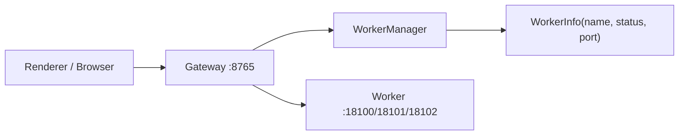

# Worker 前端对接方式 - Gateway 代理模式讨论

> 创建时间：2026-04-29

## 当前 Gateway 能力判断

当前 Gateway 的能力边界很清楚：

- HTTP：Koa Router，路径前缀 `/gateway/*`。
- WebSocket：固定 `/gateway/ws`，协议是 JSON RPC / JSON event。
- 当前 `/gateway/ws` 不适合直接承载 ASR PCM 这类高频二进制流，因为它现在会把所有入站消息 `data.toString()` 后按 JSON 解析。
- 当前 GatewayServer 已经基于 Node `http.Server`，技术上可以继续挂载额外的 HTTP 路由和额外的 WebSocket upgrade 处理。

所以 Gateway 代理可以做，但建议不要把 Worker 音频流强塞进现有 `/gateway/ws` JSON 协议。

## 代理模式一：透明反向代理（推荐）

### 核心思路

Gateway 暴露一组固定的 Worker 代理路径：

```text
HTTP:
  /gateway/workers/:name/api/*

WebSocket:
  /gateway/workers/:name/ws/*
```

前端只连接 Gateway：

```text
ASR:
  ws://{gatewayHost}:{gatewayPort}/gateway/workers/asr/ws/asr

TTS:
  ws://{gatewayHost}:{gatewayPort}/gateway/workers/tts/ws/tts

OCR:
  http://{gatewayHost}:{gatewayPort}/gateway/workers/ocr/api/ocr
  ws://{gatewayHost}:{gatewayPort}/gateway/workers/ocr/ws/ocr
```

Gateway 内部根据 `worker.name` 查 `WorkerManager.getWorkerInfo(name)`，拿到端口后再转发到本机 Worker：

```text
ws://127.0.0.1:{worker.port}/ws/asr
http://127.0.0.1:{worker.port}/api/ocr
```

### 数据流



### 优点

- 前端只认识 Gateway，不再暴露 Worker 端口。
- Worker 仍然可以只绑定 `127.0.0.1`，安全边界更好。
- LAN/Web 访问时，浏览器只需要能访问 Gateway；Worker 由主进程本机转发。
- ASR 的 PCM 二进制可以原样透传，不需要 base64 包装。
- TTS/OCR 现有 Worker 协议不用改。
- 未来如果 Worker 端口变化，前端完全无感。

### 缺点

- GatewayServer 要新增 WebSocket proxy 能力。
- 需要处理双向连接关闭、错误、背压和日志。
- Gateway 会承担业务数据转发压力，但比 JSON multiplex 轻很多。

### 适合场景

- Electron 本机使用。
- 局域网浏览器访问也要使用 ASR/TTS/OCR。
- 希望前端外部使用最简单，只填 Gateway 地址。

## 代理模式二：复用 `/gateway/ws` 做协议级多路复用

### 核心思路

在现有 Gateway JSON 协议里增加 Worker stream 消息：

```json
{ "type": "worker:open", "id": "c1", "worker": "asr", "path": "/ws/asr" }
{ "type": "worker:data", "id": "c1", "data": "<base64>" }
{ "type": "worker:close", "id": "c1" }
```

Gateway 内部再连接 Worker，并把 Worker 数据包装成 JSON event 发回来。

### 优点

- 前端只维护一条 WebSocket。
- 权限和事件模型可以集中到 Gateway 协议里。

### 缺点

- ASR PCM 需要 base64 或额外二进制帧协议，复杂度明显上升。
- 当前 GatewayClient 只处理 JSON 消息，需要大改。
- 高频音频流会给主进程和前端 JSON 解析带来额外开销。
- 协议复杂后，调试成本更高。

### 结论

不建议作为第一版。它更像远期“统一连接协议”，不是现在迁移 Worker 的低风险选择。

## 代理模式三：Gateway 业务适配器

### 核心思路

Gateway 不做透明代理，而是直接提供业务 API：

```text
worker.ocr.recognize
worker.tts.speak
worker.asr.startSession
```

Gateway 内部调用 Worker 的 HTTP/WebSocket。

### 优点

- 前端调用语义最强，不关心 Worker 路径。
- 可以把错误格式、鉴权、审计完全收敛到 Gateway。

### 缺点

- 每个 Worker 都要写专用适配器。
- ASR 流式会话仍然复杂。
- Worker 协议变化时 Gateway 适配器也要跟着改。

### 适合场景

- OCR 这类请求/响应型能力。
- 非实时、低频、需要统一错误格式的能力。

## 推荐方案

推荐采用“透明反向代理”为主，业务适配器为辅：

1. 管理通道继续走 `worker.list/start/stop/config*`。
2. 数据通道改为走 Gateway Worker Proxy：
   - `ws://gateway/gateway/workers/asr/ws/asr`
   - `ws://gateway/gateway/workers/tts/ws/tts`
   - `http://gateway/gateway/workers/ocr/api/ocr`
3. Worker 仍然绑定 `127.0.0.1`。
4. 前端新增统一 `WorkerProxyClient`，业务组件不直接拼 Worker 端口。
5. OCR 后续可以额外加 typed adapter，但 ASR/TTS 第一版保持透明代理。

这样对外最简单：

```text
前端只知道 Gateway。
Gateway 知道 Worker。
Worker 端口不暴露给前端和外部浏览器。
```

## 实施轮廓

### 后端

新增 `WorkerProxyRoutes` 或 `WorkerProxyBridge`：

- HTTP proxy：
  - Koa 路由：`/gateway/workers/:name/api/:path*`
  - 校验 worker name。
  - 查询 Worker 是否 ready。
  - 只转发到 `127.0.0.1:{worker.port}`。
  - 透传 method/body/query/header，过滤 hop-by-hop headers。

- WebSocket proxy：
  - 在 GatewayServer 上支持额外 upgrade path。
  - 路径：`/gateway/workers/:name/ws/:path*`
  - 前端 WS 建连后，Gateway 创建到 Worker 的 WS。
  - 双向 pipe message：
    - frontend binary/text → worker binary/text
    - worker binary/text → frontend binary/text
  - 任一侧关闭，另一侧同步关闭。

### 前端

新增 Worker Proxy URL 构造：

```ts
getWorkerProxyWsUrl('asr', '/ws/asr');
getWorkerProxyHttpUrl('ocr', '/api/ocr');
```

业务组件只使用：

```text
useAsrWorker()
useTtsWorker()
useOcrWorker()
```

### 安全边界

- Worker name 必须来自已注册 Worker，不允许任意 host/port。
- Worker proxy 只允许转发到本机 Worker 端口。
- 默认只代理 `status === "ready"` 的 Worker。
- 后续如果 Gateway 暴露到局域网，需要考虑 token 或同源校验。

## 风险点

1. WebSocket proxy 背压处理：
   - 第一版可以先用 `ws.send(data)` 简单透传。
   - 后续如果出现大流量阻塞，再处理 bufferedAmount。

2. bodyParser 与 HTTP proxy：
   - Koa `bodyParser` 已经提前注册，直接 pipe 原始 request 可能受影响。
   - 对图片 OCR 这种 base64 JSON，第一版可以读取 `ctx.request.body` 后用 JSON 转发。
   - 如果以后要支持 multipart 或大文件，应为 proxy path 跳过 bodyParser 或单独处理 raw body。

3. 路径设计：
   - 避免和现有 `/gateway/ws` 冲突。
   - 推荐 `/gateway/workers/:name/*`，可读且边界清楚。

4. Worker ready 判断：
   - 如果 Worker `ready` 后模型仍在内部加载，可能需要按 Worker 的 `/health` 结果再确认。

## 结论

Gateway 代理值得做，但第一版应做“透明反向代理”，不要做 JSON 多路复用。

透明代理能同时满足：

- 前端使用简单。
- Worker 端口不暴露。
- LAN/Web 访问可行。
- ASR/TTS 实时流性能相对可控。
- 当前 Worker 服务端协议不用大改。

## 第一版实施结果

已按透明反向代理落地第一版：

- Gateway JSON RPC 仍固定在 `/gateway/ws`。
- Worker 数据通道新增 `/gateway/workers/:name/api/*` 和 `/gateway/workers/:name/ws/*`。
- HTTP/WS 代理都只转发到 `WorkerManager` 中 `ready` 状态的本机 Worker。
- 前端配置只需要 Gateway 地址，ASR/TTS 已切到 Gateway Worker Proxy。
- OCR 已具备后端代理入口，前端 typed client 后续单独补齐。

第一版刻意保持透明代理，不对 Worker 响应包 `ApiResponse`，避免破坏 ASR/TTS/OCR 已有协议。

## 配置方式

代理模式下，前端只需要配置 Gateway：

```env
VITE_SERVER_PORT=8765
VITE_SERVER_HOST=127.0.0.1
```

如果要允许局域网浏览器访问应用，只开放 Gateway：

```env
VITE_SERVER_PORT=8765
VITE_SERVER_HOST=0.0.0.0
VITE_WORKER_HOST=127.0.0.1
```

含义：

- `VITE_SERVER_HOST`：Gateway 绑定地址，前端 HTTP/RPC/Worker 数据通道都访问它。
- `VITE_WORKER_HOST`：Worker 绑定地址，默认 `127.0.0.1`，通常不对外暴露。
- `VITE_MODEL_DIR`：模型目录，仍按原有逻辑由 WorkerManager 注入给 Worker。
- `WORKER_RUNTIME_HOME` / `VITE_WORKER_RUNTIME_HOME`：Worker venv、运行配置和缓存根目录。

也就是说，外部使用时不需要知道 Worker 端口，只填 Gateway 的 host/port。
